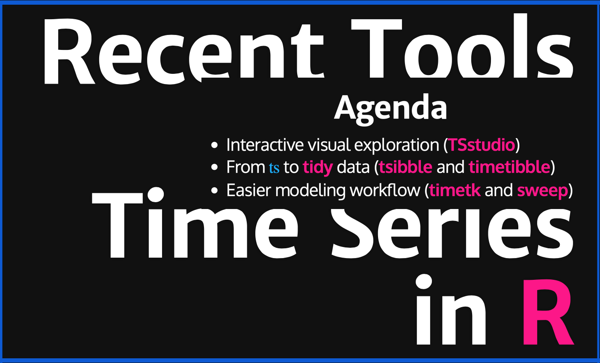
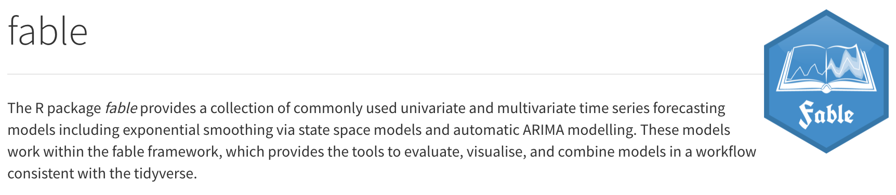
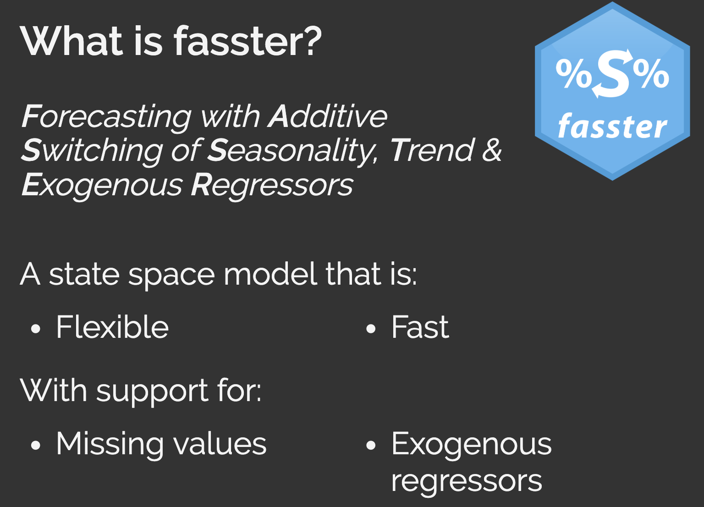
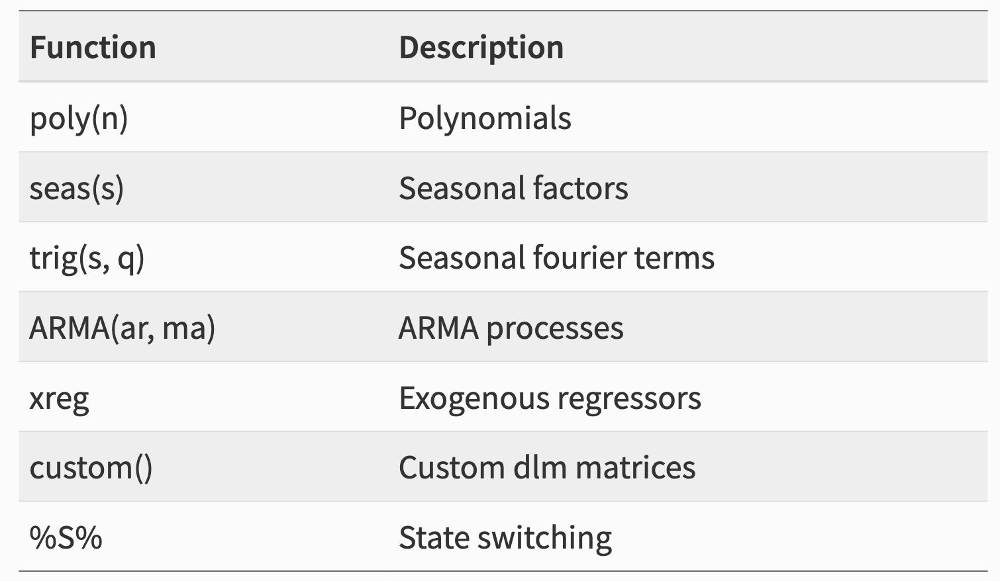

```{r setup, include=FALSE}
knitr::opts_chunk$set(echo = F, cache = T, warning = F, message = F)

# install.packages("revealjs")
# install.packages("wrapr")
# devtools::install_github("RamiKrispin/TSstudio")
# devtools::install_github("tidyverts/tsibble", build_vignettes = TRUE)

library(tidyverse)
library(tsibble)
library(fable)
library(fasster)
library(lubridate)
library(data.table)
```

----

The slides at:
https://github.com/epspi/CINDAY_RUG_2019.08.20

----

## Agenda
- What have Rob Hyndman & Monash Team been up to?
- From `ts` to **tidy** data (**tsibble** by Earo Wang)
- Time series visualization and feature extraction (**feasts**)
- Tidy modeling framework (**fable**)
- Extensibility, custom models (**fasSter** by Mitchell O'Hara-Wild) 

----

Let's make one thing clear...

**All of this tidy forecasting goodness is brought to you by Hyndman, et. al.**


----


----


----


----


----


https://github.com/epspi/CIN-DAY_RUG_03.14.2018


----

<iframe width="100%" height="500" src="https://www.youtube.com/embed/ohiOPyFsrqQ" frameborder="0" allow="autoplay; encrypted-media" allowfullscreen></iframe>

----


## Fetch and wrangle

```{r message=FALSE, warning=FALSE, include = F}
data_file = "data/traffic.csv"
data_url  = "https://data.cincinnati-oh.gov/api/views/rvmt-pkmq/rows.csv?accessType=DOWNLOAD"

# Download data if not already in place
if (!file.exists(data_file)) download.file(data_url, data_file)

traffic = fread(data_file) %>% 
  .[, .(CRASHDATE = mdy_hms(CRASHDATE),
        SNA_NEIGHBORHOOD,
        CRASHSEVERITY = str_extract(CRASHSEVERITY, "^\\d") ,
        GENDER = str_extract(GENDER, "\\w+$"))] %>% 
  .[GENDER != "UNKNOWN"] %>% 
  na.omit()
```


```{r}
glimpse(traffic)
```

[Cincinnati Traffic Crash Reports (CPD)](https://data.cincinnati-oh.gov/Safer-Streets/Traffic-Crash-Reports-CPD-/rvmt-pkmq/data)

----

### A data frame for time series


----

`as_tsibble`

```{r, echo = TRUE}
traffic_ts = traffic %>% 
  .[, .(accidents = .N)
    , by = .(CRASHDATE, SNA_NEIGHBORHOOD, CRASHSEVERITY, GENDER)] %>% 
  as_tsibble(key   = c(SNA_NEIGHBORHOOD, CRASHSEVERITY, GENDER),
             index = CRASHDATE)
```

```{r}
glimpse(traffic_ts)
```


## Easy Calendar Aggregations

```{r, echo = TRUE}
traffic_hrly = traffic_ts %>% 
  group_by_key() %>% 
  index_by(date_hour = ~lubridate::floor_date(., unit = "hour")) %>% 
  summarise(accidents = sum(accidents)) %>% 
  ungroup()
```

```{r}
glimpse(traffic_hrly)
```

----

<p class="purple">what about missing data?</p>


traditional approaches

```{r, echo = TRUE}
data.table(traffic_hrly) %>% 
  .[, .N, by = .(hour = lubridate::hour(date_hour))] %>% 
  head()
```

----

`has_gaps` helper

```{r, echo = TRUE}              
has_gaps(traffic_hrly) %>% sample_n(5) 
```

----

`count_gaps` helper

```{r eval=FALSE, echo=TRUE}
count_gaps(traffic_hrly) %>% sample_n(5)
```

----

### pad implicit missing values

```{r, echo = TRUE}
traffic_hrly = traffic_hrly %>% fill_gaps(accidents = 0)
```

----

### Functional rolling windows


## Time Series Decomposition & Plotting Helpers


## Tidy modeling



## Pipeline workflows!


```{r, echo = TRUE}
traffic_sm = traffic_hrly %>% 
  index_by(date = yearweek(date_hour)) %>% 
  summarise(accidents = sum(accidents))

traffic_sm %>% 
  model(ETS(accidents)) %>% 
  forecast(h = "3 months") %>% 
  autoplot(traffic_sm)
```

----



----

## Tons of flexibility



## In theory it's this easy!

```{r, eval = FALSE, echo = TRUE}
traffic_hrly %>% 
  model(
    ets  = ETS(accidents),
    fstr = fasster(accidents ~ weekday %S% (trig(24, 16) + poly(2)))
  ) %>% 
  mutate(
    ensemble = (ets + fstr)/2
  ) %>% 
  select(ensemble) %>%
  forecast(h = "3 months") %>% 
  autoplot(traffic_hrly)
  
```


----

**questions?**